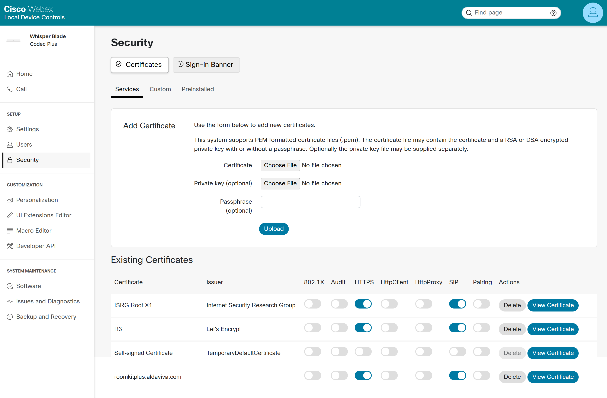

CiscoEndpointCertificateDeployer
===

Automatically upload and activate a PFX certificate and private key to a Cisco video conferencing endpoint running TC7, CE8, or later software. Useful for Let's Encrypt automation, such as Certify The Web.

<!-- MarkdownTOC autolink="true" bracket="round" autoanchor="true" levels="2" style="ordered" -->

1. [Requirements](#requirements)
1. [Usage](#usage)
1. [Result](#result)
1. [Let's Encrypt](#lets-encrypt)

<!-- /MarkdownTOC -->

<a id="requirements"></a>
## Requirements
- [.NET 8 x64 runtime](https://dotnet.microsoft.com/en-us/download/dotnet/8.0) or later
- [Cisco video conferencing endpoint](https://www.cisco.com/c/en/us/products/collaboration-endpoints/collaboration-room-endpoints/index.html)
    - *Also known as TelePresence, Collaboration Endpoint, Webex Device, room system, and codec*
    - TC, CE, or RoomOS software (tested with TC7, CE9, RoomOS 10, and RoomOS 11)
    - IX5000 is not supported
    - Username and password for an enabled account with the Admin role. If the endpoint is registered to Webex, you will need to manually enable this account.
    - HTTPS and SSH server must be enabled
    - A DNS entry, such as an A record that points to the endpoint's IPv4 address, so that browsers can validate the certificate's subject CN


<a id="usage"></a>
## Usage

```bat
CiscoEndpointCertificateDeployer.exe certificatePath endpointHostname endpointUsername endpointPassword applyToServices
```

<dl>
    <dt><code>certificatePath</code></dt>
    <dd>The absolute filesystem path of a PFX file to upload. It must have been exported with the private key.</dd>
    <dt><code>endpointHostname</code></dt>
    <dd>The hostname (such as the IP address or FQDN) of the endpoint.</dd>
    <dt><code>endpointUsername</code></dt>
    <dd>The username of an account on the endpoint with the Admin role. The factory default for Cisco endpoints is <code>admin</code>.</dd>
    <dt><code>endpointPassword</code></dt>
    <dd>The passphrase used to log in to the user above. The factory default for Cisco endpoints is the empty string.</dd>
    <dt><code>applyToServices</code></dt>
    <dd>A comma-delimited list of service names with which the new certificate will be used. Defaults to <code>https</code>, but you can include SIPS by passing <code>https,sip</code>.</dd>
</dl>

<a id="example"></a>
### Example
```bat
"C:\Program Files\CiscoEndpointCertificateDeployer\CiscoEndpointCertificateDeployer.exe" "C:\ProgramData\certify\assets\myendpoint.mycompany.com\20210817_abcdefgh.pfx" myendpoint.mycompany.com admin CISCO https,sip
```

<a id="result"></a>
## Result




<a id="lets-encrypt"></a>
## Let's Encrypt

You can use this program to automatically maintain valid certificates issued by a trusted root certificate authority like [Let's Encrypt](https://letsencrypt.org) on your Cisco endpoints. DNS verification, rather than HTTP verification, is particularly helpful when the endpoints' web servers are not exposed to inbound traffic from the internet, which you should not allow through your firewall.

<a id="certify-the-web"></a>
### Certify The Web

You can use [Certify The Web](https://certifytheweb.com) on a Windows computer to automatically renew certificates and deploy them with this program.

1. [Download](https://certifytheweb.com/home/download) and install Certify The Web.
1. Click `New Certificate`.
1. Register your email address with Let's Encrypt.
1. In the **Certificate** tab, add a domain like `myendpoint.mycompany.com` to the certificate, then click the `+` button.
1. In the **Authorization** tab, change the **Challenge Type** to **dns-01**, select your DNS provider from the **DNS Update Method** list, and supply the **Credentials** for your DNS provider with the `New` button.
1. In the Deployment tab, set the Deployment Mode to **No Deployment**, since deployments are only used for local IIS servers.
1. In the Tasks tab, add a new Deployment Task, choose **Run Powershell Script**, and set the following properties.
    |Name|Value|
    |---|---|
    |Task Name|Deploy Certificate to Cisco Endpoint|
    |Description|Upload and activate certificate on Cisco endpoint using HTTP and SSH.|
    |Trigger|Run On Success|
    |Run task even if previous task step failed|☐|
    |Authentication|Local (as current service user)|
    |Program/Script|*The absolute path to the [PowerShell script](https://github.com/Aldaviva/CiscoEndpointCertificateDeployer/blob/master/CiscoEndpointCertificateDeployer/CiscoEndpointCertificateDeployer.ps1) included with this program, such as* `C:\Program Files\CiscoEndpointCertificateDeployer\CiscoEndpointCertificateDeployer.ps1`|
    |Pass Result as First Arg|☑|
    |Impersonation LogonType|Service|
    |Arguments|*Details about your endpoint, in the form of* `endpointHostname=myendpoint.mycompany.com;endpointUsername=admin;endpointPassword=CISCO;applyToServices=https,sip`|
    |Script Timeout Mins.||
    |Launch New Process|☐|
1. Click the Save button.
1. Optionally ensure the domain validation is working using the `Test` button.
1. Request and deploy a certificate using the `Request certificate` button.
